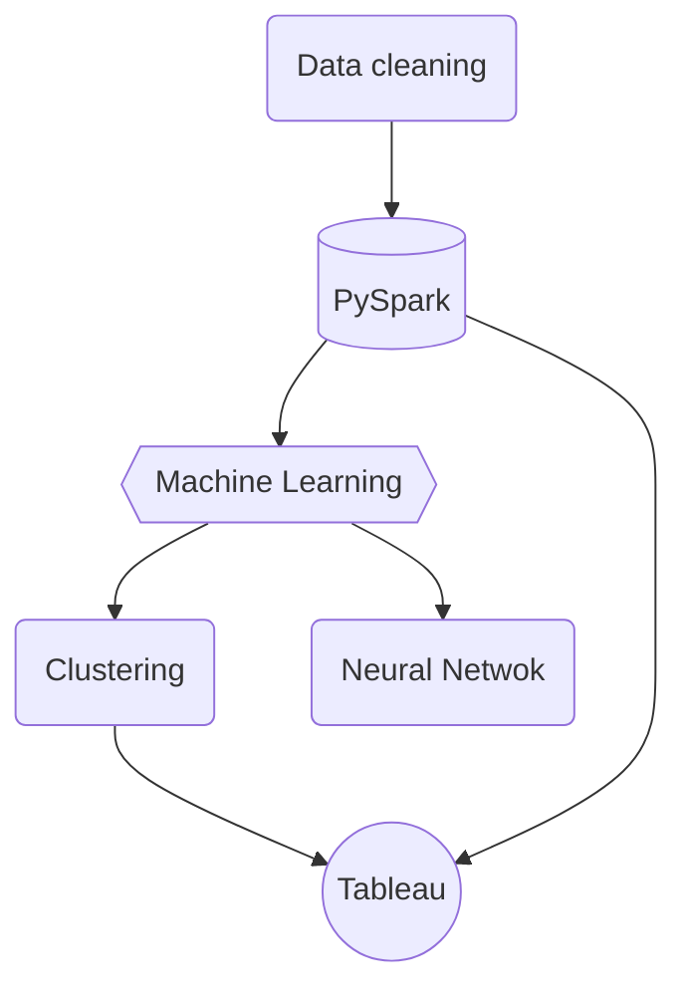
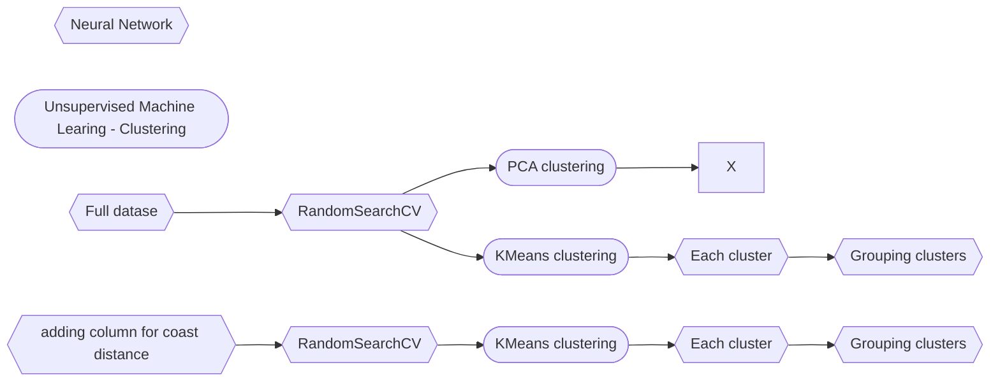

# Final Project: Perth Housing Analysis
---

## Project Summary

This project investigates different suburbs housing price in Perth and trains an algorithm to predict housing price. This dataset had about 36,000 number of property sales in Perth and most of them are in between 2013 to 2020. The data in between 2013 to 2020 was extracted to train a new model using neural network. At the beginning, the accuracy of model is only about 67.9%. To further optimising this model, dataset were seperated into clusters and, however, the accuracy of this model still low. At last, the accuracy of model increased to 81.6% after including additional information of coastal distance.


---
<b>Dataset: </b> [Dataset file](https://github.com/wingylui/housing_price_anaylsis/tree/main/Dataset) </br>
<b>Database: </b> PySpark </br>
<b>Machine Learning:</b> PCA clustering, Kmeans clustering and neural network</br>
<b>Data visualisation:</b> Tableau

<b> Workflow for this project:</b>


---
## Converting coordinates into geojson format

<b> Programming language and package used:</b> Python (Pandas, numpy and json)</br>
<b> Script:</b> [Suburb_geojson.ipynb](https://github.com/wingylui/housing_price_anaylsis/blob/main/DataCleaning/Suburb_geojson.ipynb)</br>

The [geojson file](https://github.com/wingylui/housing_price_anaylsis/blob/main/Dataset/suburb-10-wa.geojson) contains coordinates of the suburbs in Western Australia. In this section, the required coordinates will be extracted with the matching suburb name, following by putting into geojson file. This file will import into Tableau for map visualisation.

---

## Query data and calculation using PySpark

<b>Programming language and package used:</b> Python (PySpark)</br>
<b>Script:</b> [perth_housing_pyspark_colab.ipynb](https://github.com/wingylui/housing_price_anaylsis/blob/main/PySpark_SQL/perth_housing_pyspark_colab.ipynb)</br>

In this section, the [perth housing dataset](https://github.com/wingylui/housing_price_anaylsis/blob/main/Dataset/perth_housing_price_2021.csv) was imported into PySpark_SQL and extracted required data for machine learning and data visualisation in Tableau.</br>

For Machine Learning: </br>

- Only houses sold after 2013 are extracted.
- Property age of each houses were calculated 

For data visulisation in Tableau: </br>
- Only houses sold after 2013 are extracted.
- Property age, Price/floor area,  Price/land area and Land area/floor area were calculated before exporting into csv

---
## Machine learning

<b>Programming language and package used:</b> Python (sklearn, pandas and numpy)</br>
<b>Script:</b> [optimisation_neural_network.ipynb](https://github.com/wingylui/housing_price_anaylsis/blob/main/MachineLearning/optimisation_neural_network.ipynb) </br>

A short summary:</br>


The major section of this project is to build up an optimised algorithm to predict the Perth house pricing. By using ```RandomSearchCV```, the best parameters for the model is obtained and the accuracy is 67.9%.</br>
</br>
 To further increase the accuracy of this model, we tried to seperate the dataset into different clusters by using PCA clustering. Unfortunately, there is not a cluster that is distinct from the other cluster. Then, we also tried Kmeans clustering and obtained 3 major clusters from this dataset. Three different neural network models are trained using these clusters, however, only one of the three clusters have an increased accuracy (72.9%) and the others have a significantly drop in accuracy of the model. </br>
 </br>
 Then, we tried to combine the two clusters together and the accuracy of this model increased to 60.0%. </br>
  </br>
 Due to the low accuracy of the model, I try to extract more data for the dataframe, including the dwelling types (Apartments, units or houses) and coast distance. Finally, the model can reach 81.6% after adding coast distance and apartment columns.</br>
 </br>


---
## Data Visualisation

<b>BI tools:</b> Tableau</br>
<b>Script:</b> [Project4.twb](https://github.com/wingylui/housing_price_anaylsis/blob/main/Project%204.twb) </br>

The Kmeans clustering data were exported out from the Jupyter notebook and using Tableau to visualise the locations and properties of these three clusters.

Example:</br>


---
### Reference:
- [perth house price](https://www.kaggle.com/datasets/syuzai/perth-house-prices)
